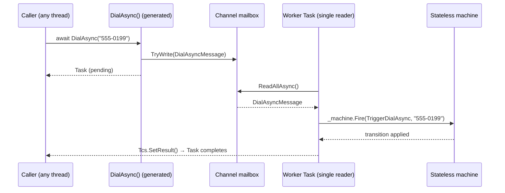

# ActiveStateMachine

**A modern .NET Roslyn source generator that turns a plain `partial class` into a fully thread-safe,
lock-free [Active Object](https://en.wikipedia.org/wiki/Active_object) around a
[Stateless](https://github.com/dotnet-state-machine/stateless) state machine.**

You describe *what* your states, triggers and public methods are. The generator writes *all* of the
concurrency plumbing for you at compile time — the mailbox, the worker loop, the message records, the
constructor and async disposal — with **zero reflection and zero runtime dependencies** beyond
Stateless itself.


---

## Table of contents

- [Why](#why)
- [Features](#features)
- [How it works](#how-it-works)
- [Getting started](#getting-started)
- [Usage](#usage)
- [The Phone example](#the-phone-example)
- [What the generator emits](#what-the-generator-emits)
- [API reference](#api-reference)
- [Parameterized triggers](#parameterized-triggers)
- [Concurrency & lifetime semantics](#concurrency--lifetime-semantics)
- [Diagnostics](#diagnostics)
- [Project layout](#project-layout)
- [Build, run & test](#build-run--test)
- [Requirements](#requirements)
- [Limitations & roadmap](#limitations--roadmap)
- [Contributing](#contributing)
- [License](#license)
- [Acknowledgements](#acknowledgements)

---

## Why

[Stateless](https://github.com/dotnet-state-machine/stateless) is an excellent, lightweight state
machine library — but a `StateMachine<TState, TTrigger>` is **not thread-safe**. If two threads fire
triggers concurrently you get races and corrupted state. The classic fix is the **Active Object**
pattern: put the machine behind a mailbox and let a single dedicated worker apply every transition
sequentially, so callers never touch the machine directly.

Writing that mailbox by hand is repetitive and easy to get wrong: a `Channel<T>`, a base message
record with a `TaskCompletionSource`, one message type per trigger, a worker loop that dispatches and
routes exceptions back to the awaiter, `TriggerWithParameters` caching, graceful shutdown… every
Active Object looks the same.

**ActiveStateMachine generates all of it.** Your source stays declarative:

```csharp
[ActiveObject(typeof(PhoneState), typeof(PhoneTrigger))]
public partial class PhoneActiveObject : IAsyncDisposable
{
    [StateTrigger("PhoneTrigger.CallDialed")]
    public partial Task DialAsync(string number);

    partial void ConfigureStateMachine() { /* wire up Stateless here */ }
}
```

…and the compiler fills in the rest.

## Features

- ⚙️ **Incremental source generator** (`IIncrementalGenerator`) — fast, cached, IDE-friendly.
- 🧵 **Lock-free thread safety** — a single `Channel`-backed worker serializes every transition.
- ⏱️ **`async`/`await` first** — every trigger method returns a `Task` that completes when the
  transition has actually been applied, and faults if it throws.
- 🎯 **Parameterized triggers** — 0–3 parameters map automatically to Stateless
  `TriggerWithParameters<…>`, with the trigger objects cached for you.
- 🧹 **Correct `IAsyncDisposable`** — completes the mailbox, drains in-flight messages, and stops the
  worker cleanly.
- 🚦 **Compile-time diagnostics** — misuse (non-`partial`, wrong return type, too many parameters…)
  becomes a build error, not a runtime surprise.
- 📦 **Analyzer packaging ready** — the generator project is configured to ship as a NuGet analyzer.
- 🪶 **No reflection, no runtime magic** — everything is plain C# you can read in the generated file.

## How it works

The `[ActiveObject]` attribute marks a class; the generator discovers it, reads the state/trigger
enums and every `[StateTrigger]` method, and emits a `{ClassName}.g.cs` partial that completes the
class. At runtime, a call flows through the mailbox to the single worker:



Because the mailbox is created with `SingleReader = true` and only one worker `Task` ever reads it,
**the state machine is only ever touched from one thread** — no locks required.

## Getting started

> The project is currently consumed via project references (a published NuGet package is on the
> [roadmap](#limitations--roadmap)). The generator project is already configured to pack as an
> analyzer.

Clone the repository and reference the two library projects from your app. The **generator** must be
referenced as an analyzer (`OutputItemType="Analyzer"`), while the **attributes** are a normal
reference:

```xml
<ItemGroup>
  <!-- Marker attributes you apply in your own code -->
  <ProjectReference Include="path/to/src/ActiveStateMachine.Attributes/ActiveStateMachine.Attributes.csproj" />

  <!-- The source generator, wired in as an analyzer -->
  <ProjectReference Include="path/to/src/ActiveStateMachine.Generators/ActiveStateMachine.Generators.csproj"
                    OutputItemType="Analyzer"
                    ReferenceOutputAssembly="false" />
</ItemGroup>

<ItemGroup>
  <!-- The one real runtime dependency -->
  <PackageReference Include="Stateless" Version="5.15.0" />
</ItemGroup>
```

Your consuming project should target **.NET 5 or later** (the generated code uses
`System.Threading.Channels` and the non-generic `TaskCompletionSource`). The example targets
`net8.0`.

## Usage

Writing an Active Object is three steps:

**1. Declare the enums and mark the class.** Apply `[ActiveObject(stateType, triggerType)]` to a
`partial class`.

```csharp
using ActiveStateMachine.Attributes;

public enum DoorState   { Open, Closed, Locked }
public enum DoorTrigger { OpenDoor, CloseDoor, Lock, Unlock }

[ActiveObject(typeof(DoorState), typeof(DoorTrigger))]
public partial class Door
{
}
```

**2. Declare the public trigger API.** Each public entry point is a `partial` method returning
`Task`, decorated with `[StateTrigger("…")]`. Zero parameters → a plain trigger; one parameter →
a `TriggerWithParameters<T>`.

```csharp
[StateTrigger("DoorTrigger.OpenDoor")]
public partial Task OpenAsync();

[StateTrigger("DoorTrigger.Lock")]
public partial Task LockAsync(string pinCode);   // parameterized trigger
```

**3. Configure the machine.** Implement `partial void ConfigureStateMachine()`. Inside it you have
access to the generated `_machine` field and, for each parameterized trigger, a cached
`Trigger{MethodName}` field (e.g. `TriggerLockAsync`) you can pass to `OnEntryFrom`:

```csharp
partial void ConfigureStateMachine()
{
    _machine.Configure(DoorState.Open)
        .Permit(DoorTrigger.CloseDoor, DoorState.Closed);

    _machine.Configure(DoorState.Closed)
        .Permit(DoorTrigger.OpenDoor, DoorState.Open)
        .Permit(DoorTrigger.Lock, DoorState.Locked);

    _machine.Configure(DoorState.Locked)
        .OnEntryFrom(TriggerLockAsync, pin => Console.WriteLine($"Locked with PIN {pin}"))
        .Permit(DoorTrigger.Unlock, DoorState.Closed);
}
```

That's it — the generator supplies the constructor, the mailbox, the worker, the bodies of
`OpenAsync`/`LockAsync`, and `DisposeAsync`. Consume it like any async object:

```csharp
await using var door = new Door(DoorState.Open);
await door.CloseAsync();
await door.LockAsync("1234");
```

> **Note on the constructor:** the generator emits `public {ClassName}({StateType} initialState)`,
> so you pass the starting state when you construct the object. Do not declare your own constructor
> with the same signature.

## The Phone example

The repository ships the canonical Stateless "telephone" example, re-expressed as an Active Object.
The full user-written source is [`PhoneActiveObject.cs`](samples/ActiveStateMachine.Example/PhoneActiveObject.cs):

```csharp
using ActiveStateMachine.Attributes;

namespace ActiveStateMachine.Example;

public enum PhoneState   { OffHook, Ringing, Connected, OnHold }
public enum PhoneTrigger { CallDialed, HungUp, CallConnected, PlacedOnHold, TakenOffHold, LeftMessage }

[ActiveObject(typeof(PhoneState), typeof(PhoneTrigger))]
public partial class PhoneActiveObject : IAsyncDisposable
{
    /// <summary>Current state. Only safe to read between awaited calls.</summary>
    public PhoneState State => _machine.State;

    [StateTrigger("PhoneTrigger.CallDialed")]
    public partial Task DialAsync(string number);   // parameterized

    [StateTrigger("PhoneTrigger.HungUp")]
    public partial Task HangUpAsync();

    [StateTrigger("PhoneTrigger.CallConnected")]
    public partial Task ConnectCallAsync();

    [StateTrigger("PhoneTrigger.PlacedOnHold")]
    public partial Task PutOnHoldAsync();

    [StateTrigger("PhoneTrigger.TakenOffHold")]
    public partial Task TakeOffHoldAsync();

    partial void ConfigureStateMachine()
    {
        _machine.Configure(PhoneState.OffHook)
            .Permit(PhoneTrigger.CallDialed, PhoneState.Ringing);

        _machine.Configure(PhoneState.Ringing)
            .OnEntryFrom(TriggerDialAsync, number => Console.WriteLine($"[Phone] Ringing... Dialing number: {number}"))
            .Permit(PhoneTrigger.HungUp, PhoneState.OffHook)
            .Permit(PhoneTrigger.CallConnected, PhoneState.Connected);

        _machine.Configure(PhoneState.Connected)
            .OnEntry(() => Console.WriteLine("[Phone] Call Connected!"))
            .OnExit(() => Console.WriteLine("[Phone] Call Ended!"))
            .Permit(PhoneTrigger.LeftMessage, PhoneState.OffHook)
            .Permit(PhoneTrigger.HungUp, PhoneState.OffHook)
            .Permit(PhoneTrigger.PlacedOnHold, PhoneState.OnHold);

        _machine.Configure(PhoneState.OnHold)
            .SubstateOf(PhoneState.Connected)
            .OnEntry(() => Console.WriteLine("[Phone] Call Placed On Hold."))
            .OnExit(() => Console.WriteLine("[Phone] Call Resumed."))
            .Permit(PhoneTrigger.TakenOffHold, PhoneState.Connected)
            .Permit(PhoneTrigger.HungUp, PhoneState.OffHook);

        _machine.OnUnhandledTrigger((state, trigger) =>
            Console.WriteLine($"[Warning] Invalid trigger '{trigger}' in state '{state}' ignored."));

        _machine.OnTransitioned(t =>
            Console.WriteLine($"[State Change] {t.Source} -> {t.Destination}"));
    }
}
```

Driving it ([`Program.cs`](samples/ActiveStateMachine.Example/Program.cs)):

```csharp
await using var phone = new PhoneActiveObject(PhoneState.OffHook);

await phone.DialAsync("555-0199");
await phone.ConnectCallAsync();
await phone.PutOnHoldAsync();
await phone.TakeOffHoldAsync();
await phone.DialAsync("123-4567");   // invalid while Connected — ignored, worker survives
await phone.HangUpAsync();
```

Produces:

```text
Starting Modern .NET Active Object Telephone Simulation...

[State Change] OffHook -> Ringing
[Phone] Ringing... Dialing number: 555-0199
[State Change] Ringing -> Connected
[Phone] Call Connected!
[State Change] Connected -> OnHold
[Phone] Call Placed On Hold.
[Phone] Call Resumed.
[State Change] OnHold -> Connected
[Warning] Invalid trigger 'CallDialed' in state 'Connected' ignored.
[Phone] Call Ended!
[State Change] Connected -> OffHook

Simulation Complete.
```

## What the generator emits

For the class above, the generator produces `PhoneActiveObject.g.cs` completing the partial class.
Abbreviated:

```csharp
// <auto-generated/>
partial class PhoneActiveObject
{
    private readonly StateMachine<PhoneState, PhoneTrigger> _machine;
    private readonly Channel<PhoneActiveObjectMessage> _messageQueue;
    private readonly Task _workerTask;
    private readonly CancellationTokenSource _cts;

    // Cached parameterized trigger (one field per parameterized method):
    private readonly StateMachine<PhoneState, PhoneTrigger>.TriggerWithParameters<string> TriggerDialAsync;

    // Base message: carries a TaskCompletionSource and knows how to apply itself.
    private abstract record PhoneActiveObjectMessage
    {
        public TaskCompletionSource Tcs { get; } = new(TaskCreationOptions.RunContinuationsAsynchronously);
        public Task Completion => Tcs.Task;
        public abstract void Execute(PhoneActiveObject ao);
    }

    // One concrete message per trigger method:
    private sealed record DialAsyncMessage(string number) : PhoneActiveObjectMessage
    {
        public override void Execute(PhoneActiveObject ao) => ao._machine.Fire(ao.TriggerDialAsync, number);
    }
    private sealed record HangUpAsyncMessage() : PhoneActiveObjectMessage
    {
        public override void Execute(PhoneActiveObject ao) => ao._machine.Fire(PhoneTrigger.HungUp);
    }
    // … ConnectCallAsyncMessage, PutOnHoldAsyncMessage, TakeOffHoldAsyncMessage …

    public PhoneActiveObject(PhoneState initialState)
    {
        _machine = new StateMachine<PhoneState, PhoneTrigger>(initialState);
        TriggerDialAsync = _machine.SetTriggerParameters<string>(PhoneTrigger.CallDialed);
        ConfigureStateMachine();                       // your configuration
        _messageQueue = Channel.CreateUnbounded<PhoneActiveObjectMessage>(
            new UnboundedChannelOptions { SingleReader = true });
        _cts = new CancellationTokenSource();
        _workerTask = Task.Run(ProcessMailboxAsync);   // the single worker
    }

    private async Task ProcessMailboxAsync()
    {
        try
        {
            await foreach (var msg in _messageQueue.Reader.ReadAllAsync(_cts.Token))
            {
                try { msg.Execute(this); msg.Tcs.SetResult(); }
                catch (Exception ex) { msg.Tcs.SetException(ex); }   // faults route to the caller
            }
        }
        catch (OperationCanceledException) { }
    }

    public partial Task DialAsync(string number)
    {
        var __msg = new DialAsyncMessage(number);
        return _messageQueue.Writer.TryWrite(__msg)
            ? __msg.Completion
            : Task.FromException(new InvalidOperationException("Active Object message queue is closed."));
    }
    // … bodies for the other trigger methods …

    public async ValueTask DisposeAsync()
    {
        _messageQueue.Writer.TryComplete();   // no more messages accepted
        try { await _workerTask; }            // drain everything already queued
        catch (OperationCanceledException) { }
        _cts.Cancel();
        _cts.Dispose();
        GC.SuppressFinalize(this);
    }
}
```

> Want to see the real thing? Build with `-p:EmitCompilerGeneratedFiles=true` and look under
> `obj/**/generated/…/PhoneActiveObject.g.cs`.

## API reference

### `[ActiveObject(Type stateType, Type triggerType)]`

Applied to a `partial class`. Declares the state and trigger enum types for the machine.

| Property | Description |
| --- | --- |
| `StateType` | The `enum` used for states. |
| `TriggerType` | The `enum` used for triggers. |

### `[StateTrigger(string trigger)]`

Applied to a `partial Task` method. `trigger` is the enum value **written as source text**, e.g.
`"PhoneTrigger.CallDialed"`. The generator normalizes it to a fully-qualified reference, so the plain
member name (`"CallDialed"`) works too.

| Method shape | Maps to |
| --- | --- |
| `partial Task FooAsync()` | `_machine.Fire(trigger)` |
| `partial Task FooAsync(T a)` | `_machine.Fire(TriggerFooAsync, a)` |
| `partial Task FooAsync(T1 a, T2 b)` | `_machine.Fire(TriggerFooAsync, a, b)` |
| `partial Task FooAsync(T1 a, T2 b, T3 c)` | `_machine.Fire(TriggerFooAsync, a, b, c)` |

### Generated members available to your code

Inside `ConfigureStateMachine()` (and any other member of the class) you can use:

- `_machine` — the `StateMachine<TState, TTrigger>` to configure.
- `Trigger{MethodName}` — the cached `TriggerWithParameters<…>` for each parameterized method (e.g.
  `TriggerDialAsync`), ready to pass to `OnEntryFrom`.

## Parameterized triggers

Stateless carries trigger arguments through `TriggerWithParameters<…>`. The generator creates and
caches one such object per parameterized trigger method and threads your method arguments straight
through to `Fire`. Up to **three** parameters are supported (Stateless's native maximum). A method
with **more than three** parameters is a compile error ([`ASM003`](#diagnostics)).

```csharp
[StateTrigger("OvenTrigger.SetProgram")]
public partial Task SetProgramAsync(int minutes, int celsius);   // -> TriggerWithParameters<int, int>
```

## Concurrency & lifetime semantics

- **Serialization.** Every trigger is applied by one worker reading a `SingleReader` channel, so the
  state machine is never accessed concurrently — no locks, no races.
- **Completion.** The `Task` returned by a trigger method completes **after** the transition has been
  applied (including Stateless entry/exit actions). Awaiting it gives you happens-before ordering.
- **Ordering.** Messages are processed in the order they were written. Firing a burst without
  awaiting each call still applies them sequentially.
- **Exceptions.** If a transition throws (e.g. an invalid trigger with no `OnUnhandledTrigger`
  handler), the exception is routed to *that call's* `Task` — the worker keeps running and later
  calls are unaffected.
- **Disposal.** `DisposeAsync()` completes the writer, awaits the worker so already-queued messages
  drain, then cancels and disposes the token source. Calls made *after* disposal return a faulted
  `Task` with `InvalidOperationException("Active Object message queue is closed.")`.
- **Reading state.** The example exposes `public PhoneState State => _machine.State`. Reading state is
  only guaranteed consistent **between** awaited calls; reading it while transitions are in flight is
  a data race. Prefer awaiting a trigger, then reading.

## Diagnostics

The generator reports build errors for misuse so problems surface at compile time:

| ID | Severity | Condition |
| --- | --- | --- |
| `ASM001` | Error | `[ActiveObject]` applied to a class that is not `partial`. |
| `ASM002` | Error | `[StateTrigger]` method does not return `System.Threading.Tasks.Task`. |
| `ASM003` | Error | `[StateTrigger]` method has more than 3 parameters. |
| `ASM004` | Error | `[StateTrigger]` method is not `partial`. |
| `ASM005` | Error | `[StateTrigger]` supplies no trigger value. |

## Project layout

```
ActiveStateMachine.sln
├─ src/
│  ├─ ActiveStateMachine.Attributes/     netstandard2.0 — [ActiveObject], [StateTrigger]
│  └─ ActiveStateMachine.Generators/     netstandard2.0 — the IIncrementalGenerator (analyzer)
├─ samples/
│  └─ ActiveStateMachine.Example/        net8.0 — the Phone console demo
└─ tests/
   └─ ActiveStateMachine.Tests/          net8.0 — xUnit behavioral + generator-diagnostic tests
```

Inside the generator project:

| File | Responsibility |
| --- | --- |
| `ActiveObjectGenerator.cs` | The `IIncrementalGenerator` pipeline: discover, validate, model. |
| `Emitter.cs` | Renders the generated `{ClassName}.g.cs` source. |
| `Model.cs` | Immutable, equatable model records used for incremental caching. |
| `Diagnostics.cs` / `DiagnosticInfo.cs` | Diagnostic descriptors and cache-safe reporting. |
| `EquatableArray.cs` | Structural-equality array wrapper for correct pipeline caching. |

## Build, run & test

```bash
# Build everything
dotnet build ActiveStateMachine.sln

# Run the Phone demo
dotnet run --project samples/ActiveStateMachine.Example

# Run the test suite
dotnet test
```

The test project ([`tests/ActiveStateMachine.Tests`](tests/ActiveStateMachine.Tests)) covers both
sides of the generator:

- **Behavioral tests** drive the generated `PhoneActiveObject` — happy-path transitions,
  parameterized triggers, serial ordering under a burst, graceful handling of invalid triggers,
  faulting after disposal, and a high-volume stress loop.
- **Diagnostic tests** run the generator in-memory with `CSharpGeneratorDriver` and assert that each
  `ASMxxx` rule fires (and that valid input produces clean output).

## Requirements

| | Version |
| --- | --- |
| .NET SDK (to build) | 8.0+ |
| Consuming project TFM | .NET 5.0+ (for `System.Threading.Channels` and non-generic `TaskCompletionSource`) |
| Stateless | 5.15.0 |
| Generator / Attributes TFM | `netstandard2.0` |
| Roslyn | `Microsoft.CodeAnalysis.CSharp` 4.8.0 |

## Limitations & roadmap

Current, intentional V1 scope:

- The generated constructor is fixed to `({StateType} initialState)`; a consuming class cannot
  declare its own constructor with that signature.
- Trigger methods must return `Task` (not `Task<T>` / `ValueTask`).
- The target class must be top-level (nested classes are not yet handled).
- Up to 3 trigger parameters (Stateless's native limit).

Ideas on the roadmap:

- [ ] Publish signed NuGet packages (generator + attributes).
- [ ] Optional factory / parameterless-constructor patterns and a configurable initial state.
- [ ] `Task<T>` results for triggers that produce a value.
- [ ] Nested and generic host classes.
- [ ] Auto-emit the marker attributes into the consuming compilation for a truly dependency-free
      package.

## Contributing

Issues and pull requests are welcome. A good PR:

1. Builds clean (`dotnet build` — no new warnings).
2. Adds or updates tests under `tests/ActiveStateMachine.Tests` (behavioral and/or diagnostic).
3. Keeps the generated code readable — if you change the emitter, include a regenerated sample in the
   PR description.

## License

Released under the MIT License. _(Add a `LICENSE` file to the repository root before publishing.)_

## Acknowledgements

- [Stateless](https://github.com/dotnet-state-machine/stateless) — the state machine library this
  builds upon, and the source of the telephone example.
- The .NET Roslyn team for `IIncrementalGenerator` and `System.Threading.Channels`.
