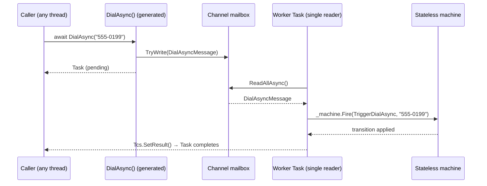
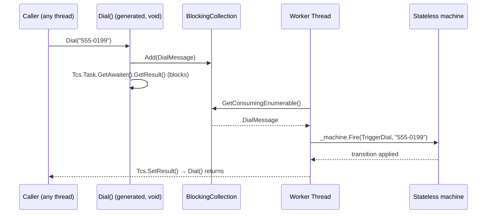

# ActiveStateMachine

**A modern .NET Roslyn source generator that turns a plain `partial class` into a fully thread-safe,
lock-free [Active Object](https://en.wikipedia.org/wiki/Active_object) around a
[Stateless](https://github.com/dotnet-state-machine/stateless) state machine.**

You describe *what* your states, triggers and public methods are. The generator writes *all* of the
concurrency plumbing for you at compile time — the mailbox, the worker, the message types, the
constructor and disposal — with **zero reflection and zero runtime dependencies** beyond Stateless
itself.

Two flavours are available, selected by the attribute you apply:

- **`[ActiveObjectAsync]`** — the modern implementation: a `System.Threading.Channels.Channel` mailbox
  drained by a worker `Task`, trigger methods that return `Task`, and `IAsyncDisposable`.
- **`[ActiveObjectSync]`** — the classic implementation: a `BlockingCollection<T>` drained by a
  dedicated background `Thread`, trigger methods that return `void` and **block** the caller until the
  message has been processed, and `IDisposable`. No `async`/`await`, no `Task`-returning API, no
  Channels.


---

## Table of contents

- [Why](#why)
- [Features](#features)
- [How it works](#how-it-works)
- [Getting started](#getting-started)
- [Usage](#usage)
- [The Phone example](#the-phone-example)
- [What the generator emits](#what-the-generator-emits)
- [API reference](#api-reference)
- [Parameterized triggers](#parameterized-triggers)
- [Concurrency & lifetime semantics](#concurrency--lifetime-semantics)
- [Diagnostics](#diagnostics)
- [Project layout](#project-layout)
- [Build, run & test](#build-run--test)
- [Requirements](#requirements)
- [Limitations & roadmap](#limitations--roadmap)
- [Contributing](#contributing)
- [License](#license)
- [Acknowledgements](#acknowledgements)

---

## Why

[Stateless](https://github.com/dotnet-state-machine/stateless) is an excellent, lightweight state
machine library — but a `StateMachine<TState, TTrigger>` is **not thread-safe**. If two threads fire
triggers concurrently you get races and corrupted state. The classic fix is the **Active Object**
pattern: put the machine behind a mailbox and let a single dedicated worker apply every transition
sequentially, so callers never touch the machine directly.

Writing that mailbox by hand is repetitive and easy to get wrong: a `Channel<T>`, a base message
record with a `TaskCompletionSource`, one message type per trigger, a worker loop that dispatches and
routes exceptions back to the awaiter, `TriggerWithParameters` caching, graceful shutdown… every
Active Object looks the same.

**ActiveStateMachine generates all of it.** Your source stays declarative:

```csharp
[ActiveObjectAsync(typeof(PhoneState), typeof(PhoneTrigger))]
public partial class PhoneActiveObject : IAsyncDisposable
{
    [StateTrigger("PhoneTrigger.CallDialed")]
    public partial Task DialAsync(string number);

    partial void ConfigureStateMachine() { /* wire up Stateless here */ }
}
```

…and the compiler fills in the rest. Swap `[ActiveObjectAsync]` for `[ActiveObjectSync]` (and
`Task`→`void`, `IAsyncDisposable`→`IDisposable`) to get the blocking thread-based variant instead.

## Features

- ⚙️ **Incremental source generator** (`IIncrementalGenerator`) — fast, cached, IDE-friendly.
- 🧵 **Lock-free thread safety** — a single worker serializes every transition, so the state machine
  is only ever touched from one thread. No locks.
- 🔀 **Two flavours, same API shape** — pick modern async (`Channel` + `Task`) or classic blocking
  (`Thread` + `BlockingCollection`) per class, just by changing the attribute.
- ⏱️ **Completion-aware calls** — async triggers return a `Task` that completes when the transition
  has actually been applied; sync triggers block until then. Either way, exceptions surface to the
  caller, not the worker.
- 🎯 **Parameterized triggers** — 0–3 parameters map automatically to Stateless
  `TriggerWithParameters<…>`, with the trigger objects cached for you.
- 🧹 **Correct disposal** — `IAsyncDisposable` (async) or `IDisposable` (sync) that drains in-flight
  messages and stops the worker cleanly.
- 🚦 **Compile-time diagnostics** — misuse (non-`partial`, wrong return type, too many parameters…)
  becomes a build error, not a runtime surprise.
- 📦 **Analyzer-only package** — the marker attributes are injected into your compilation by the
  generator, so there is no attributes assembly to reference; the only dependency is `Stateless`.
- 🪶 **No reflection, no runtime magic** — everything is plain C# you can read in the generated file.

## How it works

At build time the generator first injects the `[ActiveObjectAsync]`, `[ActiveObjectSync]` and
`[StateTrigger]` marker attributes into your compilation (via `RegisterPostInitializationOutput`), so
you never reference an attributes assembly. It then discovers each marked class, reads the
state/trigger enums and every `[StateTrigger]` method, and emits a `{ClassName}.g.cs` partial that
completes the class. At runtime, a call flows through the mailbox to the single worker (the async
variant shown here):



Because the mailbox is created with `SingleReader = true` and only one worker `Task` ever reads it,
**the state machine is only ever touched from one thread** — no locks required.

The **sync** variant is the same idea without the async machinery — a dedicated `Thread` drains a
`BlockingCollection`, and the caller blocks on a `TaskCompletionSource` (used purely as the
wait/exception-marshalling primitive) until its message is processed:



## Getting started

Install the package. It is **analyzer-only** — the marker attributes are injected straight into your
compilation by the generator, so there is no attributes assembly to reference. The single reference
also flows the one runtime dependency, `Stateless`:

```bash
dotnet add package ActiveStateMachine
```

or in your `.csproj`:

```xml
<ItemGroup>
  <PackageReference Include="ActiveStateMachine" Version="1.2.0" />
</ItemGroup>
```

Your consuming project should target **.NET 5 or later** (the async generated code uses
`System.Threading.Channels` and the non-generic `TaskCompletionSource`; the sync code uses
`BlockingCollection<T>` and `TaskCompletionSource<bool>`). The examples target `net8.0`.

> **Building from source instead?** Reference the generator as an analyzer and add `Stateless`
> yourself. There is no attributes project to reference — the generator supplies the attributes:
>
> ```xml
> <ProjectReference Include="path/to/src/ActiveStateMachine.Generators/ActiveStateMachine.Generators.csproj"
>                   OutputItemType="Analyzer" ReferenceOutputAssembly="false" />
> <PackageReference Include="Stateless" Version="5.15.0" />
> ```

Maintainers: see [PUBLISHING.md](PUBLISHING.md) for how the package is built and pushed to nuget.org.

## Usage

Writing an Active Object is three steps. This walkthrough uses the **async** flavour; the
[sync differences](#the-sync-flavour) follow.

**1. Declare the enums and mark the class.** Apply `[ActiveObjectAsync(stateType, triggerType)]` to a
`partial class`.

```csharp
using ActiveStateMachine.Attributes;

public enum DoorState   { Open, Closed, Locked }
public enum DoorTrigger { OpenDoor, CloseDoor, Lock, Unlock }

[ActiveObjectAsync(typeof(DoorState), typeof(DoorTrigger))]
public partial class Door : IAsyncDisposable
{
}
```

**2. Declare the public trigger API.** Each public entry point is a `partial` method returning
`Task`, decorated with `[StateTrigger("…")]`. Zero parameters → a plain trigger; one parameter →
a `TriggerWithParameters<T>`.

```csharp
[StateTrigger("DoorTrigger.OpenDoor")]
public partial Task OpenAsync();

[StateTrigger("DoorTrigger.Lock")]
public partial Task LockAsync(string pinCode);   // parameterized trigger
```

**3. Configure the machine.** Implement `partial void ConfigureStateMachine()`. Inside it you have
access to the generated `_machine` field and, for each parameterized trigger, a cached
`Trigger{MethodName}` field (e.g. `TriggerLockAsync`) you can pass to `OnEntryFrom`:

```csharp
partial void ConfigureStateMachine()
{
    _machine.Configure(DoorState.Open)
        .Permit(DoorTrigger.CloseDoor, DoorState.Closed);

    _machine.Configure(DoorState.Closed)
        .Permit(DoorTrigger.OpenDoor, DoorState.Open)
        .Permit(DoorTrigger.Lock, DoorState.Locked);

    _machine.Configure(DoorState.Locked)
        .OnEntryFrom(TriggerLockAsync, pin => Console.WriteLine($"Locked with PIN {pin}"))
        .Permit(DoorTrigger.Unlock, DoorState.Closed);
}
```

That's it — the generator supplies the constructor, the mailbox, the worker, the bodies of
`OpenAsync`/`LockAsync`, and `DisposeAsync`. Consume it like any async object:

```csharp
await using var door = new Door(DoorState.Open);
await door.CloseAsync();
await door.LockAsync("1234");
```

> **Note on the constructor:** the generator emits
> `public {ClassName}({StateType} initialState, string? name = null)`, so you pass the starting state
> (and optionally a name — see [Naming](#naming)) when you construct the object. Do not declare your
> own constructor with the same signature.

### Naming

Every Active Object has a name. You can set a default on the attribute, and/or override it per
instance in the constructor:

```csharp
[ActiveObjectAsync(typeof(DoorState), typeof(DoorTrigger), Name = "Door")]  // default for the type
public partial class Door : IAsyncDisposable { /* … */ }

var a = new Door(DoorState.Open);                 // name = "Door"       (from the attribute)
var b = new Door(DoorState.Open, "front-door");   // name = "front-door" (constructor wins)
var c = new Door(DoorState.Open);                 // with no attribute Name, defaults to "Door" (the class name)
```

Resolution order: **constructor argument** → **attribute `Name`** → **class name**. The current name
is exposed as a `public string Name` property. It is also surfaced where it helps most while
debugging:

- **Sync** (`[ActiveObjectSync]`) — it becomes the **worker `Thread.Name`**, so each Active Object's
  thread is identifiable in the debugger's Threads window and in call stacks.
- **Async** (`[ActiveObjectAsync]`) — it is published to a `public static AsyncLocal<string?>`
  **`CurrentActiveObjectName`** on the generated class, set on the worker task. Because `AsyncLocal`
  flows with the execution context, any code run by the Active Object (Stateless entry/exit actions,
  awaited continuations) can read `MyActiveObject.CurrentActiveObjectName.Value` to discover which
  instance it is executing inside.

### The sync flavour

For the classic blocking variant, change three things: use `[ActiveObjectSync]`, make the trigger
methods `partial void`, and implement `IDisposable` instead of `IAsyncDisposable`. The parameterized
trigger field drops the `Async` suffix to match the method name (`TriggerLock`):

```csharp
[ActiveObjectSync(typeof(DoorState), typeof(DoorTrigger))]
public partial class Door : IDisposable
{
    [StateTrigger("DoorTrigger.OpenDoor")]
    public partial void Open();

    [StateTrigger("DoorTrigger.Lock")]
    public partial void Lock(string pinCode);   // -> OnEntryFrom(TriggerLock, …)

    partial void ConfigureStateMachine() { /* identical Stateless configuration */ }
}

// Calls are synchronous and block until the transition has been applied:
using var door = new Door(DoorState.Open);
door.Close();
door.Lock("1234");
```

## The Phone example

The repository ships the canonical Stateless "telephone" example, re-expressed as an Active Object
**twice** — once per flavour, producing identical console output:

- [`samples/ActiveStateMachine.Example.Async`](samples/ActiveStateMachine.Example.Async) — the async
  version shown below.
- [`samples/ActiveStateMachine.Example.Sync`](samples/ActiveStateMachine.Example.Sync) — the blocking
  thread-based version (`[ActiveObjectSync]`, `partial void` triggers, `IDisposable`, no `await`).

The full async source is [`PhoneActiveObject.cs`](samples/ActiveStateMachine.Example.Async/PhoneActiveObject.cs):

```csharp
using ActiveStateMachine.Attributes;

namespace ActiveStateMachine.Example.Async;

public enum PhoneState   { OffHook, Ringing, Connected, OnHold }
public enum PhoneTrigger { CallDialed, HungUp, CallConnected, PlacedOnHold, TakenOffHold, LeftMessage }

[ActiveObjectAsync(typeof(PhoneState), typeof(PhoneTrigger))]
public partial class PhoneActiveObject : IAsyncDisposable
{
    /// <summary>Current state. Only safe to read between awaited calls.</summary>
    public PhoneState State => _machine.State;

    [StateTrigger("PhoneTrigger.CallDialed")]
    public partial Task DialAsync(string number);   // parameterized

    [StateTrigger("PhoneTrigger.HungUp")]
    public partial Task HangUpAsync();

    [StateTrigger("PhoneTrigger.CallConnected")]
    public partial Task ConnectCallAsync();

    [StateTrigger("PhoneTrigger.PlacedOnHold")]
    public partial Task PutOnHoldAsync();

    [StateTrigger("PhoneTrigger.TakenOffHold")]
    public partial Task TakeOffHoldAsync();

    partial void ConfigureStateMachine()
    {
        _machine.Configure(PhoneState.OffHook)
            .Permit(PhoneTrigger.CallDialed, PhoneState.Ringing);

        _machine.Configure(PhoneState.Ringing)
            .OnEntryFrom(TriggerDialAsync, number => Console.WriteLine($"[Phone] Ringing... Dialing number: {number}"))
            .Permit(PhoneTrigger.HungUp, PhoneState.OffHook)
            .Permit(PhoneTrigger.CallConnected, PhoneState.Connected);

        _machine.Configure(PhoneState.Connected)
            .OnEntry(() => Console.WriteLine("[Phone] Call Connected!"))
            .OnExit(() => Console.WriteLine("[Phone] Call Ended!"))
            .Permit(PhoneTrigger.LeftMessage, PhoneState.OffHook)
            .Permit(PhoneTrigger.HungUp, PhoneState.OffHook)
            .Permit(PhoneTrigger.PlacedOnHold, PhoneState.OnHold);

        _machine.Configure(PhoneState.OnHold)
            .SubstateOf(PhoneState.Connected)
            .OnEntry(() => Console.WriteLine("[Phone] Call Placed On Hold."))
            .OnExit(() => Console.WriteLine("[Phone] Call Resumed."))
            .Permit(PhoneTrigger.TakenOffHold, PhoneState.Connected)
            .Permit(PhoneTrigger.HungUp, PhoneState.OffHook);

        _machine.OnUnhandledTrigger((state, trigger) =>
            Console.WriteLine($"[Warning] Invalid trigger '{trigger}' in state '{state}' ignored."));

        _machine.OnTransitioned(t =>
            Console.WriteLine($"[State Change] {t.Source} -> {t.Destination}"));
    }
}
```

Driving it ([`Program.cs`](samples/ActiveStateMachine.Example.Async/Program.cs)):

```csharp
await using var phone = new PhoneActiveObject(PhoneState.OffHook);

await phone.DialAsync("555-0199");
await phone.ConnectCallAsync();
await phone.PutOnHoldAsync();
await phone.TakeOffHoldAsync();
await phone.DialAsync("123-4567");   // invalid while Connected — ignored, worker survives
await phone.HangUpAsync();
```

The [sync driver](samples/ActiveStateMachine.Example.Sync/Program.cs) is the same script with the
`await`s removed and `Thread.Sleep` in place of `Task.Delay` — e.g. `phone.Dial("555-0199");`. Both
produce:

```text
Starting Modern .NET Active Object Telephone Simulation...

[State Change] OffHook -> Ringing
[Phone] Ringing... Dialing number: 555-0199
[State Change] Ringing -> Connected
[Phone] Call Connected!
[State Change] Connected -> OnHold
[Phone] Call Placed On Hold.
[Phone] Call Resumed.
[State Change] OnHold -> Connected
[Warning] Invalid trigger 'CallDialed' in state 'Connected' ignored.
[Phone] Call Ended!
[State Change] Connected -> OffHook

Simulation Complete.
```

## What the generator emits

Alongside the marker attributes (emitted once per compilation as
`ActiveStateMachine.Attributes.g.cs`), the generator produces one `{ClassName}.g.cs` per Active
Object. For the async class above it emits `PhoneActiveObject.g.cs`, completing the partial class.
Abbreviated (the **sync** flavour is the same shape with a `BlockingCollection` + `Thread` instead of
a `Channel` + `Task`, `void` trigger bodies that block on `Tcs.Task.GetAwaiter().GetResult()`, and a
synchronous `Dispose()`):

```csharp
// <auto-generated/>
partial class PhoneActiveObject
{
    private readonly StateMachine<PhoneState, PhoneTrigger> _machine;
    private readonly Channel<PhoneActiveObjectMessage> _messageQueue;
    private readonly Task _workerTask;
    private readonly CancellationTokenSource _cts;

    // Cached parameterized trigger (one field per parameterized method):
    private readonly StateMachine<PhoneState, PhoneTrigger>.TriggerWithParameters<string> TriggerDialAsync;

    // Base message: carries a TaskCompletionSource and knows how to apply itself.
    private abstract record PhoneActiveObjectMessage
    {
        public TaskCompletionSource Tcs { get; } = new(TaskCreationOptions.RunContinuationsAsynchronously);
        public Task Completion => Tcs.Task;
        public abstract void Execute(PhoneActiveObject ao);
    }

    // One concrete message per trigger method:
    private sealed record DialAsyncMessage(string number) : PhoneActiveObjectMessage
    {
        public override void Execute(PhoneActiveObject ao) => ao._machine.Fire(ao.TriggerDialAsync, number);
    }
    private sealed record HangUpAsyncMessage() : PhoneActiveObjectMessage
    {
        public override void Execute(PhoneActiveObject ao) => ao._machine.Fire(PhoneTrigger.HungUp);
    }
    // … ConnectCallAsyncMessage, PutOnHoldAsyncMessage, TakeOffHoldAsyncMessage …

    public PhoneActiveObject(PhoneState initialState)
    {
        _machine = new StateMachine<PhoneState, PhoneTrigger>(initialState);
        TriggerDialAsync = _machine.SetTriggerParameters<string>(PhoneTrigger.CallDialed);
        ConfigureStateMachine();                       // your configuration
        _messageQueue = Channel.CreateUnbounded<PhoneActiveObjectMessage>(
            new UnboundedChannelOptions { SingleReader = true });
        _cts = new CancellationTokenSource();
        _workerTask = Task.Run(ProcessMailboxAsync);   // the single worker
    }

    private async Task ProcessMailboxAsync()
    {
        try
        {
            await foreach (var msg in _messageQueue.Reader.ReadAllAsync(_cts.Token))
            {
                try { msg.Execute(this); msg.Tcs.SetResult(); }
                catch (Exception ex) { msg.Tcs.SetException(ex); }   // faults route to the caller
            }
        }
        catch (OperationCanceledException) { }
    }

    public partial Task DialAsync(string number)
    {
        var __msg = new DialAsyncMessage(number);
        return _messageQueue.Writer.TryWrite(__msg)
            ? __msg.Completion
            : Task.FromException(new InvalidOperationException("Active Object message queue is closed."));
    }
    // … bodies for the other trigger methods …

    public async ValueTask DisposeAsync()
    {
        _messageQueue.Writer.TryComplete();   // no more messages accepted
        try { await _workerTask; }            // drain everything already queued
        catch (OperationCanceledException) { }
        _cts.Cancel();
        _cts.Dispose();
        GC.SuppressFinalize(this);
    }
}
```

> Want to see the real thing? Build with `-p:EmitCompilerGeneratedFiles=true` and look under
> `obj/**/generated/…/PhoneActiveObject.g.cs`.

## API reference

### `[ActiveObjectAsync(Type stateType, Type triggerType)]` / `[ActiveObjectSync(Type stateType, Type triggerType)]`

Applied to a `partial class`. Declares the state and trigger enum types for the machine, and selects
the implementation flavour. A class uses exactly one of the two.

| | `[ActiveObjectAsync]` | `[ActiveObjectSync]` |
| --- | --- | --- |
| Mailbox | `System.Threading.Channels.Channel` | `System.Collections.Concurrent.BlockingCollection<T>` |
| Worker | a `Task` (`Task.Run`) | a dedicated background `Thread` |
| Trigger method return | `Task` | `void` (blocks until processed) |
| Disposal | `IAsyncDisposable` (`DisposeAsync`) | `IDisposable` (`Dispose`) |
| Uses `async`/`await` | yes | no |
| Name is surfaced as | `static AsyncLocal<string?> CurrentActiveObjectName` | the worker `Thread.Name` |

Both take the same constructor arguments and expose the same properties:

| Member | Description |
| --- | --- |
| ctor `initialState` | The starting state passed to the `StateMachine`. |
| ctor `name` (optional) | Per-instance name; overrides the attribute's `Name`. Defaults to the attribute `Name`, then the class name. See [Naming](#naming). |
| `StateType` (attribute) | The `enum` used for states. |
| `TriggerType` (attribute) | The `enum` used for triggers. |
| `Name` (attribute, optional) | Default name for the type. |
| `Name` (instance property) | The resolved name of this instance. |

### `[StateTrigger(string trigger)]`

Applied to a `partial` trigger method (`partial Task …` on an async class, `partial void …` on a sync
class). `trigger` is the enum value **written as source text**, e.g. `"PhoneTrigger.CallDialed"`. The
generator normalizes it to a fully-qualified reference, so the plain member name (`"CallDialed"`)
works too.

| Method shape (async / sync) | Maps to |
| --- | --- |
| `partial Task Foo()` / `partial void Foo()` | `_machine.Fire(trigger)` |
| `… Foo(T a)` | `_machine.Fire(TriggerFoo, a)` |
| `… Foo(T1 a, T2 b)` | `_machine.Fire(TriggerFoo, a, b)` |
| `… Foo(T1 a, T2 b, T3 c)` | `_machine.Fire(TriggerFoo, a, b, c)` |

### Generated members available to your code

Inside `ConfigureStateMachine()` (and any other member of the class) you can use:

- `_machine` — the `StateMachine<TState, TTrigger>` to configure.
- `Trigger{MethodName}` — the cached `TriggerWithParameters<…>` for each parameterized method (e.g.
  `TriggerDialAsync` or `TriggerDial`), ready to pass to `OnEntryFrom`.
- `Name` — the resolved instance name (`public string`).
- `CurrentActiveObjectName` — *(async only)* the `public static AsyncLocal<string?>` carrying this
  Active Object's name on its worker context. See [Naming](#naming).

## Parameterized triggers

Stateless carries trigger arguments through `TriggerWithParameters<…>`. The generator creates and
caches one such object per parameterized trigger method and threads your method arguments straight
through to `Fire`. Up to **three** parameters are supported (Stateless's native maximum). A method
with **more than three** parameters is a compile error ([`ASM003`](#diagnostics)).

```csharp
[StateTrigger("OvenTrigger.SetProgram")]
public partial Task SetProgramAsync(int minutes, int celsius);   // -> TriggerWithParameters<int, int>
```

## Concurrency & lifetime semantics

Both flavours share the same guarantees; they differ only in *how* a caller observes completion
(awaiting a `Task` vs. blocking) and in the disposal interface.

- **Serialization.** Every trigger is applied by a single worker — one `Task` reading a `SingleReader`
  channel (async), or one dedicated `Thread` draining a `BlockingCollection` (sync). The state machine
  is never accessed concurrently — no locks, no races.
- **Completion.** A trigger is "done" **after** the transition has been applied (including Stateless
  entry/exit actions). The async method's `Task` completes at that point; the sync method *returns* at
  that point. Either way you get happens-before ordering.
- **Ordering.** Messages are processed in the order they were enqueued. Firing an async burst without
  awaiting each call still applies them sequentially.
- **Exceptions.** If a transition throws (e.g. an invalid trigger with no `OnUnhandledTrigger`
  handler), the exception is routed to *that call* — a faulted `Task` (async) or thrown from the
  blocking call (sync, unwrapped via `GetAwaiter().GetResult()`). The worker keeps running; later
  calls are unaffected.
- **Disposal.** `DisposeAsync()` / `Dispose()` stops accepting new messages, drains everything already
  queued, and stops the worker. Calls made *after* disposal fail with
  `InvalidOperationException("Active Object message queue is closed.")` (a faulted `Task` for async, a
  thrown exception for sync).
- **Reading state.** The examples expose `public PhoneState State => _machine.State`. Reading state is
  only guaranteed consistent **between** calls; reading it while a transition is in flight is a data
  race. Prefer completing a trigger, then reading.

## Diagnostics

The generator reports build errors for misuse so problems surface at compile time:

| ID | Severity | Condition |
| --- | --- | --- |
| `ASM001` | Error | An Active Object attribute applied to a class that is not `partial`. |
| `ASM002` | Error | `[StateTrigger]` on an `[ActiveObjectAsync]` class does not return `System.Threading.Tasks.Task`. |
| `ASM003` | Error | `[StateTrigger]` method has more than 3 parameters. |
| `ASM004` | Error | `[StateTrigger]` method is not `partial`. |
| `ASM005` | Error | `[StateTrigger]` supplies no trigger value. |
| `ASM006` | Error | `[StateTrigger]` on an `[ActiveObjectSync]` class does not return `void`. |

## Project layout

```
ActiveStateMachine.sln
├─ src/
│  └─ ActiveStateMachine.Generators/       netstandard2.0 — the IIncrementalGenerator + attributes (the whole package)
├─ samples/
│  ├─ ActiveStateMachine.Example.Async/    net8.0 — the Phone demo, async flavour ([ActiveObjectAsync])
│  └─ ActiveStateMachine.Example.Sync/     net8.0 — the Phone demo, sync flavour  ([ActiveObjectSync])
└─ tests/
   └─ ActiveStateMachine.Tests/            net8.0 — xUnit behavioral + generator-diagnostic tests
```

Inside the generator project:

| File | Responsibility |
| --- | --- |
| `ActiveObjectGenerator.cs` | The `IIncrementalGenerator`: post-init attributes, plus one pipeline per flavour (discover, validate, model). |
| `EmbeddedAttributes.cs` | The `[ActiveObjectAsync]`/`[ActiveObjectSync]`/`[StateTrigger]` source injected into each consuming compilation. |
| `AsyncEmitter.cs` | Renders the async `{ClassName}.g.cs` (Channel + Task + `IAsyncDisposable`). |
| `SyncEmitter.cs` | Renders the sync `{ClassName}.g.cs` (BlockingCollection + Thread + `IDisposable`). |
| `Model.cs` | Immutable, equatable model records used for incremental caching. |
| `Diagnostics.cs` / `DiagnosticInfo.cs` | Diagnostic descriptors and cache-safe reporting. |
| `EquatableArray.cs` | Structural-equality array wrapper for correct pipeline caching. |

## Build, run & test

```bash
# Build everything
dotnet build ActiveStateMachine.sln

# Run the Phone demos
dotnet run --project samples/ActiveStateMachine.Example.Async
dotnet run --project samples/ActiveStateMachine.Example.Sync

# Run the test suite
dotnet test
```

The test project ([`tests/ActiveStateMachine.Tests`](tests/ActiveStateMachine.Tests)) covers both
sides of the generator:

- **Behavioral tests** drive both generated `PhoneActiveObject`s — happy-path transitions,
  parameterized triggers, serial ordering under concurrent load, graceful handling of invalid
  triggers, exceptions propagating to the caller, faulting/throwing after disposal, and a high-volume
  stress loop.
- **Diagnostic tests** run the generator in-memory with `CSharpGeneratorDriver` and assert that each
  `ASMxxx` rule fires (and that valid async *and* sync input produces clean output).

## Requirements

| | Version |
| --- | --- |
| .NET SDK (to build) | 8.0+ |
| Consuming project TFM | .NET 5.0+ (for `System.Threading.Channels` and non-generic `TaskCompletionSource`) |
| Stateless | 5.15.0 (flowed automatically as the package's only dependency) |
| Generator TFM | `netstandard2.0` |
| Roslyn | `Microsoft.CodeAnalysis.CSharp` 4.8.0 |

## Limitations & roadmap

Current, intentional V1 scope:

- The generated constructor is fixed to `({StateType} initialState, string? name = null)`; a
  consuming class cannot declare its own constructor with that signature.
- Trigger methods return `Task` (async flavour) or `void` (sync flavour) — no `Task<T>` / `ValueTask`
  results yet.
- The target class must be top-level (nested classes are not yet handled).
- Up to 3 trigger parameters (Stateless's native limit).

Ideas on the roadmap:

- [x] Package as a single NuGet package. See [PUBLISHING.md](PUBLISHING.md).
- [x] Auto-emit the marker attributes into the consuming compilation for an analyzer-only package
      (only `Stateless` remains as a dependency).
- [ ] Publish signed / source-linked builds via CI.
- [ ] Optional factory / parameterless-constructor patterns and a configurable initial state.
- [ ] `Task<T>` results for triggers that produce a value.
- [ ] Nested and generic host classes.

## Contributing

Issues and pull requests are welcome. A good PR:

1. Builds clean (`dotnet build` — no new warnings).
2. Adds or updates tests under `tests/ActiveStateMachine.Tests` (behavioral and/or diagnostic).
3. Keeps the generated code readable — if you change the emitter, include a regenerated sample in the
   PR description.

## License

Released under the MIT License — see [LICENSE](LICENSE).

## Acknowledgements

- [Stateless](https://github.com/dotnet-state-machine/stateless) — the state machine library this
  builds upon, and the source of the telephone example.
- The .NET Roslyn team for `IIncrementalGenerator` and `System.Threading.Channels`.
